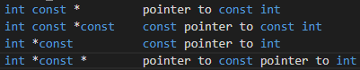

[主页](https://ganggangxiao.github.io/)
[文章](https://ganggangxiao.github.io/list/)
[关于](https://ganggangxiao.github.io/about/)
[我的GitHub](https://github.com/ganggangxiao/)
[本网站托管地址](https://github.com/ganggangxiao/ganggangxiao.github.io/)
[评论](https://github.com/ganggangxiao/ganggangxiao.github.io/issues)  
创建时间 2022 03 30 | 修改时间 2022 04 07

# **0004 - C++学习 01 - const和指针**

C++ Primer 5e上有一种很不错的方法判断复合类型的含义，我给大家分享一下，那就是从右往左阅读，离对象最近的符号对对象的类型有最直接的影响：   
for an example： 
  
如果读不懂，可以尝试把星号读作Pointer to   
这里有一个规律，星号左边的标识符可以任意调换顺序，右边亦是这样，但是左右边不能乱换。 
所以int const\*和const int\*没有什么区别 
希望这篇文章能帮到你 
如果文章中有错误，可以在本网页的托管地址提issue

## **以上 - The End.**

